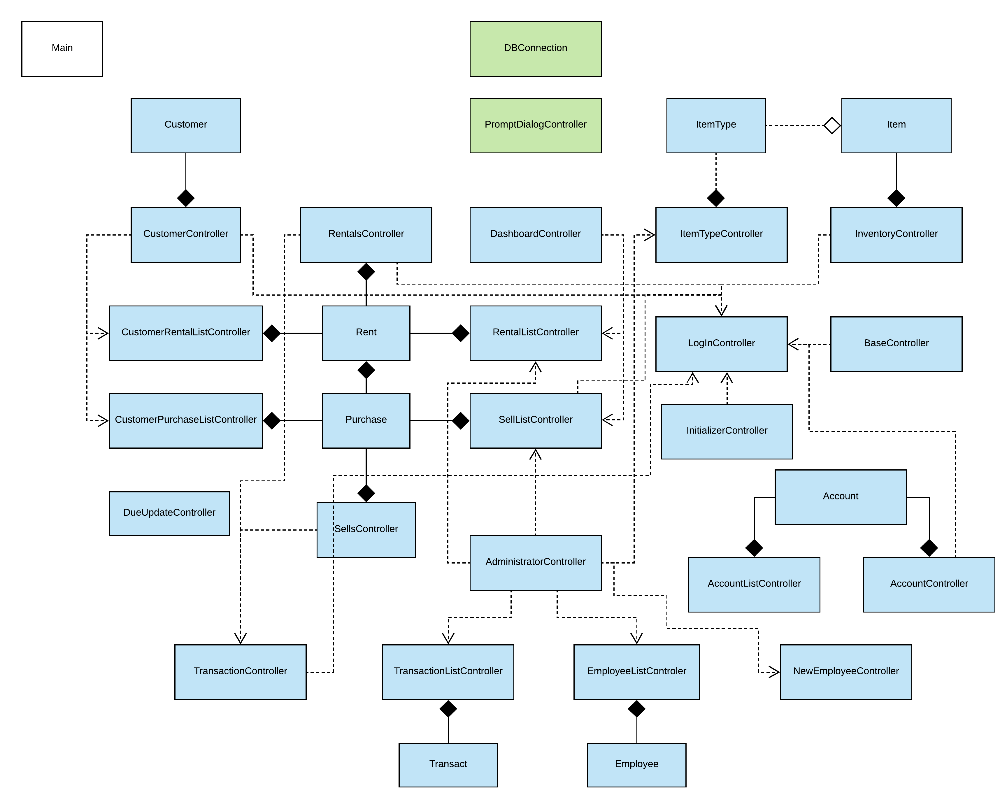
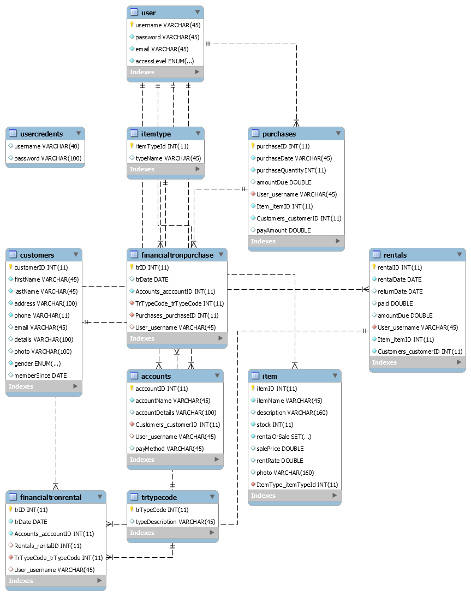
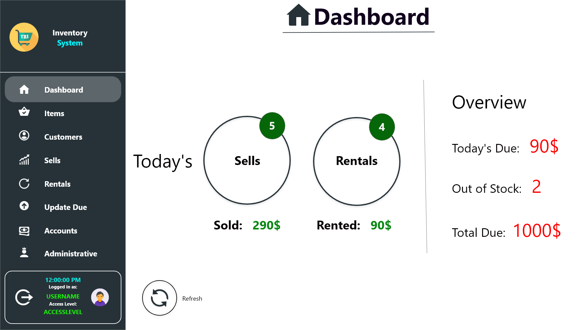
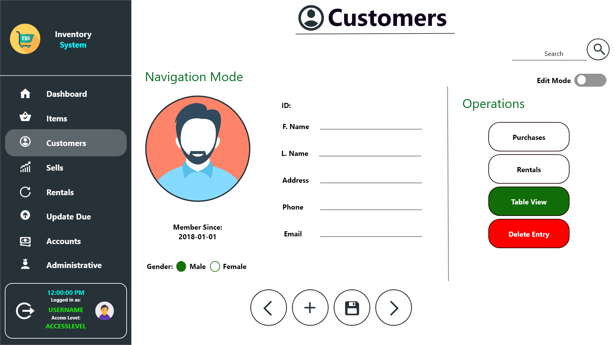

## Inventory Management System 
Now that I look back to the codebase after a few years being a Software Engineer, it feels like a nightmare to me! I broke every rules SOLID suggests like a king! Thanks for understanding! LOL

**Multi-user, RDBMS system for inventory management**
 Worked on this project for my RDBMS course in DIU 

**Tech Stack**
 JavaFX, MySQL

**Environment**
- Intellij Idea
- MySQL Workbench 8 on Legacy Mode
- JDK 8
- Gluon Scene Builder

## Installation
1. Make sure **MySQL** is installed properly and running at port **3306** with username **'root'** and password **'root'** 
2. <code>git clone https://github.com/afifaniks/InventorySystem.git</code>
3. Open **MySQL Workbench** and login to your root account
4. From **File** menu click **Open SQL Script**
5. Navigate to: <code>../InventorySystem/sql</code> and select <code>inventory.sql</code> file
6. From **Query** menu select **Execute All** and wait till it finishes
7. Navigate to <code>InventorySystem/jar/</code>
8. Open CMD/Terminal and type: <code>java -jar InventorySystem.jar</code>
9. You're all set!
 
**Watch this video for more:**
[https://youtu.be/Q35IDSXXz3Y](https://youtu.be/Q35IDSXXz3Y)

## Features
- Dashboard
- Multi-level Access Privilege
- Auto Due Update
- Elegant UI and Robust Visualization
- Relational Database Oriented System
- Multi-threaded

## CAUTION
- MySQL Workbench should be installed in port **3306** with username **'root'** and password **'root'**
- **JDK 1.8** should be installed and available to system path

## Project Skeleton
UML Class Diagram:

Databse Schema:

Prototypes:

**For any query contact through: https://afifaniks.github.io** 

